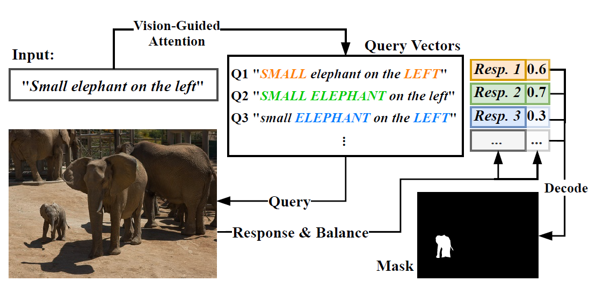

# [Vision-Language Transformer and Query Generation for Referring Segmentation](https://arxiv.org/abs/2108.05565)

Please consider citing our paper in your publications if the project helps your research.
```
@inproceedings{vision-language-transformer,
  title={Vision-Language Transformer and Query Generation for Referring Segmentation},
  author={Ding, Henghui and Liu, Chang and Wang, Suchen and Jiang, Xudong},
  booktitle={Proceedings of the IEEE International Conference on Computer Vision},
  year={2021}
}
```

## Introduction

Vision-Language Transformer (VLT) is a framework for referring segmentation task. Our method produces multiple query vector for one input language expression, and use each of them to “query” the input image, generating a set of responses. Then the network selectively aggregates these responses, in which queries that provide better comprehensions are spotlighted.

<p align="center">

</p>

## Installation

1. Environment:

   - Python 3.6
   - tensorflow 1.15
   - Other dependencies in `requirements.txt`
   - SpaCy model for embedding: 
      
      ```python -m spacy download en_vectors_web_lg```
   - **Note from Yash** — Install `pycocotools==2.0.0` with pip after installing requirements.txt

2. Dataset preparation

   - Put the folder of COCO training set ("`train2014`") under `data/images/`.

   - Download the RefCOCO dataset from [here](https://github.com/lichengunc/refer) and extract them to `data/`. Then run the script for data preparation under `data/`:
   
      ```
      cd data
      python data_process_v2.py --data_root . --output_dir data_v2 --dataset [refcoco/refcoco+/refcocog] --split [unc/umd/google] --generate_mask
      ```

## Evaluating

1. Download pretrained models & config files from [here](https://entuedu-my.sharepoint.com/:f:/g/personal/liuc0058_e_ntu_edu_sg/EpE88e5DW1NEl6p7sKlMvrcBhBLeMTuHbtNKDiJCvhQBtQ?e=6thFDa).

2. In the config file, set: 

   - `evaluate_model`: path to the pretrained weights
   - `evaluate_set`: path to the dataset for evaluation.

3. Run
   ```
   python vlt.py test [PATH_TO_CONFIG_FILE]
   ```

## Training

1. Pretrained Backbones:
   We use the backbone weights proviede by [MCN](https://github.com/luogen1996/MCN/blob/master/data/README.md).

   *Note*: we use the backbone that ***excludes*** all images that appears in the val/test splits of RefCOCO, RefCOCO+ and RefCOCOg.

2. Specify hyperparameters, dataset path and pretrained weight path in the configuration file. Please refer to the examples under `/config`, or config file of our pretrained models.

3. Run
   ```
   python vlt.py train [PATH_TO_CONFIG_FILE]
   ```

## Acknowledgement

We borrowed a lot of codes from [MCN](https://github.com/luogen1996/MCN), [keras-transformer](https://github.com/CyberZHG/keras-transformer), [RefCOCO API](https://github.com/lichengunc/refer) and [keras-yolo3](https://github.com/qqwweee/keras-yolo3). Thanks for their excellent works!

